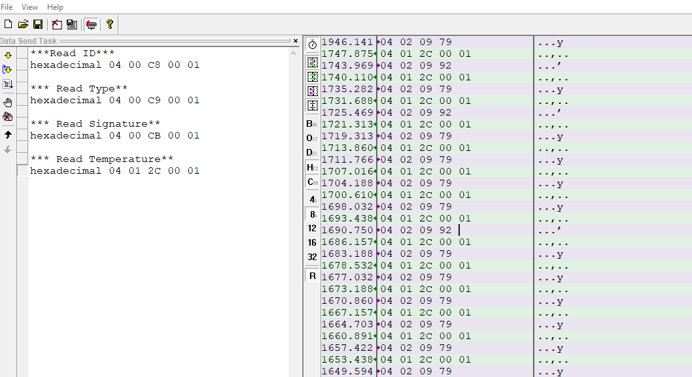

Walkthrough / Quickstart
========================

To get the example up and running without any modifications, you can follow this walkthorugh

#. Follow the setup chapter carefully to setup hardware and firmware carefully.
#. Open a terminal tool and connect to the border router board via USB.
#. Send a correct Modbus packet into the the border router.
   For the Tibbo sensors BP#01 the modbus request (hex) 04 01 2C 00 01 is the correct command to read the temperature.
   On the mesh router the packet will look like this on the UART 40 04 01 2C 00 01 FE EE.
   The address = 0x40 and FE EE is the CRC for this specific packet.
   
How to observe the output
-------------------------
In the terminal emulator observe the response to the modbus request.
In figure below, the green lines are modbus request and the purple are responses showing a temperature during test of 24.5-25.0 degree for the Tibbo sensors BP#01

